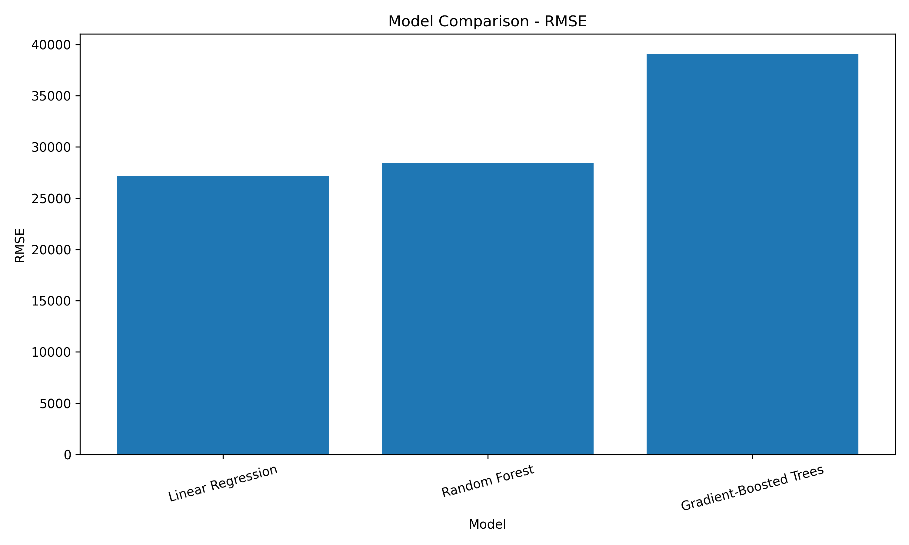
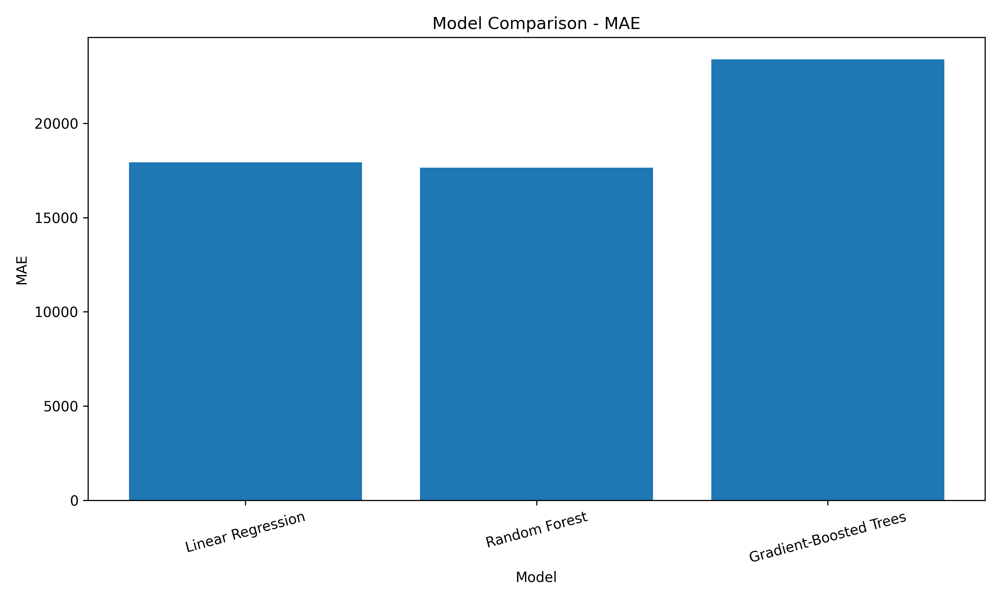
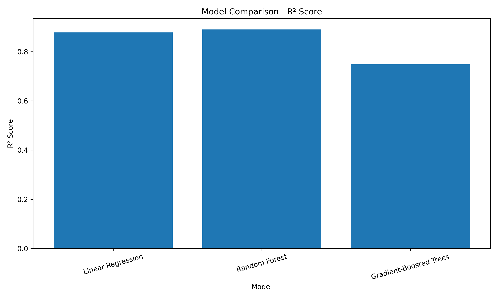
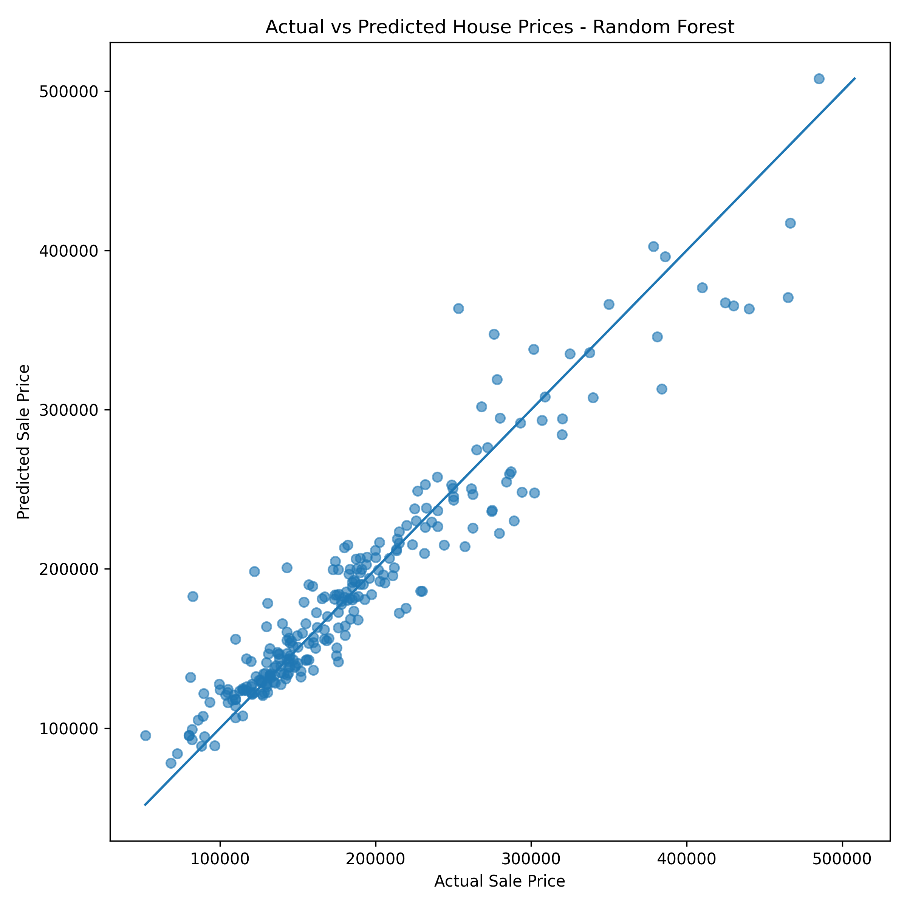

# 🏠 House Sale Price Prediction using PySpark

A machine learning project for predicting house sale prices using **Apache Spark (PySpark)** and multiple regression algorithms.

The project uses the **Ames Housing dataset** and demonstrates an end-to-end machine learning workflow including data exploration, missing-value analysis, feature engineering, preprocessing, model training, evaluation, model comparison, and visualization.

---

# 🚀 Project Highlights

- 📊 Exploratory data analysis using PySpark
- 🔍 Missing value analysis and handling
- 🔢 Numerical and categorical feature identification
- 🧹 Median imputation for numerical missing values
- 🏷️ Categorical missing value handling
- 🔠 String indexing and one-hot encoding
- 🧩 Feature vector creation
- 🤖 Linear Regression model
- 🌲 Random Forest Regressor
- 🚀 Gradient-Boosted Trees Regressor
- 📈 Model evaluation using RMSE, MAE, and R²
- 🏆 Model comparison and final model selection
- 📊 Model performance visualizations
- 🎯 Actual vs Predicted house price visualization

---

# 📂 Project Structure

```text
spark-house-price-prediction/
│
├── data/
│   └── train.csv
│
├── src/
│   ├── 01_data_exploration.py
│   ├── 02_missing_values.py
│   ├── 03_feature_types.py
│   ├── 04_correct_feature_types.py
│   ├── 05_preprocessing.py
│   ├── 06_train_test_split.py
│   ├── 07_linear_regression.py
│   ├── 08_random_forest.py
│   ├── 09_gradient_boosted_trees.py
│   ├── 10_model_comparison.py
│   ├── 11_save_model.py
│   ├── 12_model_comparison_chart.py
│   └── 13_actual_vs_predicted.py
│
├── outputs/
│   └── Generated charts
│
├── screenshots/
│   ├── model_rmse_comparison.png
│   ├── model_mae_comparison.png
│   ├── model_r2_comparison.png
│   └── actual_vs_predicted.png
│
├── .gitignore
├── requirements.txt
└── README.md
```

---

# 📊 Dataset

This project uses the **Ames Housing dataset** for predicting house sale prices.

The dataset contains information about residential properties, including:

- Lot area
- Overall quality
- Overall condition
- Year built
- Number of bedrooms
- Number of bathrooms
- Garage information
- Basement information
- Neighborhood
- House style
- Sale condition
- Sale price

The target variable is:

```text
SalePrice
```

The dataset file is located at:

```text
data/train.csv
```

---

# 🛠️ Technologies Used

- Python 3.10
- Apache Spark
- PySpark
- Java 11
- Spark MLlib
- Pandas
- Matplotlib
- Git
- GitHub

---

# ⚙️ Requirements

Before running this project, make sure the following are installed:

- Python 3.10+
- Java 11
- Apache Spark
- PySpark

You can verify your installations using:

```powershell
python --version
```

```powershell
java -version
```

```powershell
pyspark --version
```

---

# ⚙️ Installation and Setup

## 1. Clone the Repository

```bash
git clone https://github.com/YOUR_USERNAME/spark-house-price-prediction.git
```

Move into the project directory:

```bash
cd spark-house-price-prediction
```

---

## 2. Create a Virtual Environment

```powershell
python -m venv .venv
```

Activate the virtual environment:

```powershell
.\.venv\Scripts\Activate.ps1
```

---

## 3. Install Dependencies

```powershell
pip install -r requirements.txt
```

---

## 4. Verify PySpark

```powershell
python -c "import pyspark; print('PySpark:', pyspark.__version__)"
```

---

# ▶️ Running the Project

Run the scripts sequentially from the project root directory.

## 1. Data Exploration

```powershell
python src\01_data_exploration.py
```

This step:

- Loads the Ames Housing dataset
- Displays sample records
- Shows dataset schema
- Displays descriptive statistics for `SalePrice`

---

## 2. Missing Value Analysis

```powershell
python src\02_missing_values.py
```

This step identifies columns containing missing values.

The dataset contains missing values in columns such as:

- PoolQC
- MiscFeature
- Alley
- Fence
- FireplaceQu
- LotFrontage
- GarageType
- GarageYrBlt
- BsmtQual
- MasVnrType
- Electrical

---

## 3. Feature Type Identification

```powershell
python src\03_feature_types.py
```

This step separates features into:

- Numerical features
- Categorical features

The target column is:

```text
SalePrice
```

---

## 4. Correct Feature Types

```powershell
python src\04_correct_feature_types.py
```

This step corrects incorrectly identified feature types.

Examples include:

- LotFrontage
- MasVnrArea
- GarageYrBlt

---

## 5. Data Preprocessing

```powershell
python src\05_preprocessing.py
```

The preprocessing pipeline includes:

### Numerical Features

- Median imputation for missing values

### Categorical Features

- Missing value replacement
- String indexing
- One-hot encoding

Finally, all features are combined into a single machine learning feature vector.

The final processed dataset contains:

- 1,460 rows
- 305 features

---

## 6. Train-Test Split

```powershell
python src\06_train_test_split.py
```

The dataset is divided into:

- Training data
- Testing data

The training dataset is used to train machine learning models.

The testing dataset is used to evaluate model performance.

---

# 🤖 Machine Learning Models

The project evaluates multiple regression algorithms.

---

## 7. Linear Regression

```powershell
python src\07_linear_regression.py
```

The Linear Regression model produced the following results:

| Metric | Score |
|---|---:|
| RMSE | 27,188.64 |
| MAE | 17,934.66 |
| R² | 0.8780 |

---

## 8. Random Forest Regressor

```powershell
python src\08_random_forest.py
```

The Random Forest model uses:

- 100 trees
- Maximum depth of 10

Model results:

| Metric | Score |
|---|---:|
| RMSE | 28,441.83 |
| MAE | 17,648.43 |
| R² | 0.8900 |

---

## 9. Gradient-Boosted Trees Regressor

```powershell
python src\09_gradient_boosted_trees.py
```

The Gradient-Boosted Trees model produced:

| Metric | Score |
|---|---:|
| RMSE | 39,081.43 |
| MAE | 23,390.16 |
| R² | 0.7480 |

---

# 📈 Model Comparison

Run:

```powershell
python src\10_model_comparison.py
```

The following models were evaluated:

| Model | RMSE | MAE | R² |
|---|---:|---:|---:|
| Linear Regression | 27,188.64 | 17,934.66 | 0.878 |
| Random Forest | 28,441.83 | 17,648.43 | 0.890 |
| Gradient-Boosted Trees | 39,081.43 | 23,390.16 | 0.748 |

---

# 🏆 Final Model Selection

The **Random Forest Regressor** was selected as the recommended model.

### Reasons

- Highest R² score: **0.890**
- Lowest MAE: **17,648.43**

Although Linear Regression achieved the lowest RMSE, Random Forest provided the best overall balance across the evaluation metrics.

---

# 💾 Save the Final Model

Run:

```powershell
python src\11_save_model.py
```

This step saves the selected machine learning model for future predictions.

---

# 📊 Model Performance Visualizations

Run:

```powershell
python src\12_model_comparison_chart.py
```

This script creates visual comparisons of:

- RMSE
- MAE
- R²

Generated charts are saved in:

```text
outputs/
```

---

# 🎯 Actual vs Predicted Prices

Run:

```powershell
python src\13_actual_vs_predicted.py
```

This script:

- Trains the selected model
- Generates predictions
- Compares actual house prices with predicted prices
- Creates a visualization

The chart is saved as:

```text
outputs/actual_vs_predicted.png
```

---

# 📊 Visualizations

## RMSE Comparison



---

## MAE Comparison



---

## R² Comparison



---

## Actual vs Predicted House Prices



---

# 🔄 Machine Learning Workflow

```text
Ames Housing Dataset
        │
        ▼
Data Exploration
        │
        ▼
Missing Value Analysis
        │
        ▼
Feature Type Identification
        │
        ▼
Feature Type Correction
        │
        ▼
Data Preprocessing
        │
        ▼
Feature Engineering
        │
        ▼
Train-Test Split
        │
        ▼
Model Training
        │
        ├── Linear Regression
        │
        ├── Random Forest
        │
        └── Gradient-Boosted Trees
        │
        ▼
Model Evaluation
        │
        ▼
Model Comparison
        │
        ▼
Final Model Selection
        │
        ▼
Performance Visualizations
```

---

# 📏 Evaluation Metrics

The models are evaluated using the following regression metrics.

## RMSE — Root Mean Squared Error

RMSE measures the average prediction error while giving greater importance to larger errors.

A lower RMSE indicates better model performance.

---

## MAE — Mean Absolute Error

MAE measures the average absolute difference between predicted and actual house prices.

A lower MAE indicates better predictions.

---

## R² — Coefficient of Determination

R² measures how much variation in house prices is explained by the model.

A higher R² score indicates a better fit.

---

## 📊 Model Results

The following regression models were trained and evaluated:

| Model | RMSE | MAE | R² |
|---|---:|---:|---:|
| Linear Regression | 27,188.64 | 17,934.66 | 0.878 |
| Random Forest Regressor | 28,441.83 | 17,648.43 | 0.890 |
| Gradient-Boosted Trees | 39,081.43 | 23,390.16 | 0.748 |

### 🏆 Final Model Selection

**Recommended Model: Random Forest Regressor**

Random Forest achieved:

- Highest **R² score: 0.890**
- Lowest **MAE: 17,648.43**

Although Linear Regression achieved the lowest RMSE, Random Forest provided the strongest overall balance between prediction accuracy and explanatory power.

---

# 📌 Key Learnings

This project demonstrates practical experience with:

- Apache Spark
- PySpark DataFrames
- Spark SQL
- Missing value analysis
- Feature engineering
- Data preprocessing
- Categorical feature encoding
- VectorAssembler
- Spark ML Pipelines
- Regression algorithms
- Model evaluation
- Model comparison
- Data visualization

---

# ⚠️ Notes

This project was developed and tested using:

```text
Python 3.10
Java 11
Apache Spark 3.5.8
```

When running PySpark on Windows, warnings related to `winutils.exe`, `HADOOP_HOME`, or native Hadoop libraries may appear depending on the local environment configuration.

---

# 🚀 Future Improvements

Possible improvements to this project include:

- Hyperparameter tuning using CrossValidator
- Grid search for Random Forest parameters
- Additional feature engineering
- Log transformation of SalePrice
- Feature importance analysis
- Deploying the trained model as a REST API
- Building an interactive prediction dashboard
- Dockerizing the PySpark application

---

# 👨‍💻 Author

**Tushar Soni**

GitHub: https://github.com/tusharsoni8102-byte